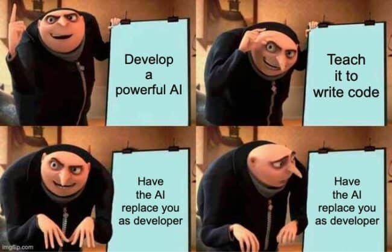

  

**Reflection on AI Use in ICS 314**

---

**I. Introduction**

Artificial Intelligence (AI) has significantly transformed education, serving as a powerful tool for supporting student learning, practice, and problem-solving. In the field of software engineering, AI tools like ChatGPT and GitHub Copilot help with coding, debugging, writing, and conceptual understanding. In ICS 314, I primarily used ChatGPT to support assignments, reinforce understanding, and quickly check code. These tools aligned well with the course's hands-on, project-focused style and contributed to efficient trial and error during the development cycle.

---

**II. Personal Experience with AI (by Activity)**

1. **Experience WODs**
   At first, I tried to complete them without using AI, thinking I could handle it on my own—but I crashed and burned. So I started attending the weekly Wednesday online Practice WODs and used AI during those sessions. AI helped clarify what the code was doing, which made it easier to move forward—even imperfectly—as a self-proclaimed perfectionist.

2. **In-class Practice WODs**
   Because I had used AI during Experience WODs, I had a good grasp of the concepts. AI helped me understand the flow of writing and debugging code, giving me confidence to tackle things I wouldn't have been able to figure out on my own.

3. **In-class WODs**
   I made full use of AI. Thanks to the practice and experience beforehand, I understood what I was supposed to do right away. Even when I made mistakes, I developed the ability to predict what was going wrong and no longer felt lost.

4. **Essays**
   I used ChatGPT to brainstorm structure and generate sample sentences. For example, I asked it to help with "ESLint: Beginner’s Friend". I edited the output to match my tone.

5. **Final Project**
   I asked ChatGPT several questions about Vercel. For example: “How do I connect Vercel to Next.js and make it work?” It provided a solid starting point, though I had to tweak it to match our schema. Through repeated inquiries, I came across valuable information I wouldn’t have found otherwise.

6. **Learning Concepts / Tutorials**
   To understand ESLint errors, I asked: “What does ‘expected indentation of 2 spaces but found 4’ mean?” It helped me grasp things quickly and conveniently.

7. **Answering Questions in Class or Discord**
   Before asking others, I often wrote down my thoughts in ChatGPT to clarify them and make it easier for others to respond.

8. **Asking or Answering a Smart Question**
   I asked ChatGPT: “Explain Issue Driven Project Management in GitHub projects,” which deepened my understanding.

9. **Providing Code Examples**
   I prompted: “Give an example using underscore .pluck.” ChatGPT provided: `_.pluck(users, 'name')`, which was helpful.

10. **Explaining Code**
    I asked: “Explain this code step by step.” It made understanding nested structures and function behavior easier.

11. **Writing Code**
    I asked: “Write a function to filter out inactive users.” It gave me a clean example I could build on.

12. **Documenting Code**
    I asked: “Write a JSDoc comment for this function,” and it provided a standardized documentation block.

13. **Quality Assurance**
    I asked: “Fix the ESLint error in this code,” providing the code snippet. ChatGPT gave good advice, although sometimes it missed configuration-specific issues.

14. **Other**
    I asked: “Write a professional commit message for fixing a form validation bug.” It helped me save time and maintain clarity.

---

**III. Impact on Learning and Understanding**

Using AI sped up my understanding of software engineering concepts. It filled in knowledge gaps and offered timely support when I got stuck. That said, I found I remembered things better when I struggled on my own first. Now I mostly use AI for reviewing and as a secondary resource.

---

**IV. Real-world Applications**

Outside ICS 314, I used AI for managing financial templates related to day trading. Applying AI in real-life situations deepened my understanding and showed its potential. However, if my prompts were vague, the responses were also vague, which reminded me how important clear communication is.

---

**V. Challenges and Opportunities**

A major challenge was outdated or misleading info on newer technologies like Next.js and Supabase. However, AI’s potential for code review and suggesting best practices seems promising for future integration into coursework.

---

**VI. Comparison with Traditional Methods**

Traditional learning builds foundational skills, while AI boosts speed and helps when you get stuck. But over-relying on it can hinder growth, so using AI wisely is key.

---

**VII. Future Outlook**

I believe AI will be embedded into IDEs, providing real-time explanations and generating test cases. An education mode that offers hints rather than full answers would be an ideal evolution.

---

**VIII. Conclusion**

AI has been a reliable supporter in learning, coding, and understanding concepts in ICS 314. But it’s important to use it in a way that doesn’t hinder personal growth. When used in balance, it can lead to deeper learning and more efficient development.

---

**AI Acknowledgment**
I used ChatGPT to help with drafting, editing, and organizing the content of this essay. All experiences described reflect my own development journey in ICS 314.
