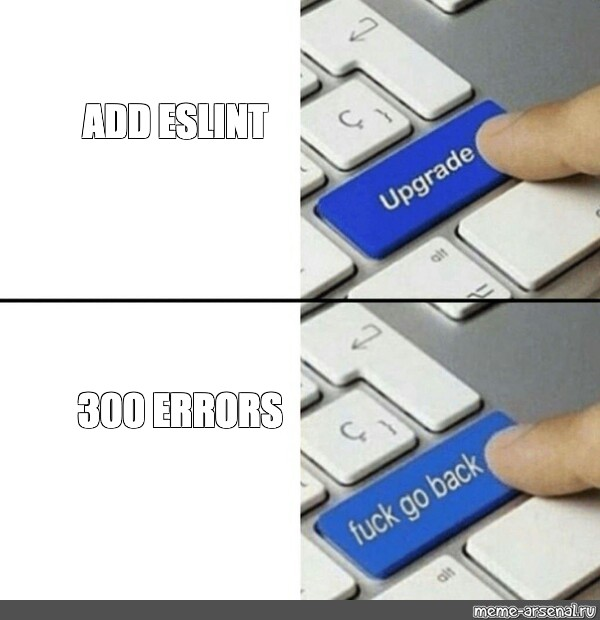

 

## **Introduction**  

TDD, code reviews, pair programming, documentation. I have been exposed to a lot of technique in the past ICS classes to help better the code. At first, however, they barely made sense. One I had was code reviews, they were logically good but were inefficient. Others, like TDD, were just nonsense.  

---

## **What you mean TDD?**  

Test-driven development (TDD) was just frustrating. So in one of the assignments, the professor gave us the test cases and told us to "make them pass." But at that time, I barely knew how to write a working function.  

I remember this one assignment where I needed to make a function work with user input correctly. The test cases were already provided, but I had no idea how to proceed with debugging the function. I stared at my screen, wondering:  

- **What exactly are these tests checking for?**  
- **What is a "valid" output?**  
- **Why do some of the test cases pass and others fail?**  

Then, I just coded some random change in my function, ran the tests, and kept my finger crossed each time hoping test will pass. Even when I passed the tests, I wasn’t sure if my solution was actually good or I was just lucky. The whole process made me feel like TDD was only for experienced programmers, not for beginners like me.  

---

## **ESLint: The Strict but Friendly Coach**  

Then I started using ESLint in VSCode, and for the first time, I was like, *this is actually really nice.* Unlike TDD, which had been overwhelming, ESLint provided instant and clear feedback.  

A specific instance that came to mind was when ESLint reminded me that I had an unused variable in my code. I thought my code was okay, but when I looked again, I had forgotten to use that variable in a part of a function. If it weren't for ESLint, I would have probably spent hours debugging. ESLint wasn't just forcing me to follow the rules—it was forcing me to write better code.  

---

## **Why I Think ESLint Is Better than Others**  

### **Pair Programming: A Confusing Experience**  

Pair programming can be beneficial, but as a beginner, it was frustrating most of the time. If my partner was more skilled, I'd feel intimidated and scared. And if we were both on the same level noobies, it was… yeah, I think you can guess.  

I once wasted 30 minutes with my partner debating how to perform a function, only to realize that neither of our solutions were correct. Pair programming is great if at least one person knows what they’re doing, but for two beginners, it is a waste of time.  

---

### **Code Reviews vs. ESLint**  

Code review is helpful, but it depends on someone else's time. Especially since this is a university, professors and TAs are busy, and waiting for feedback takes time. (*some people don't even respond :[ *)  

ESLint, on the other hand, provides immediate feedback. Regardless of whether it is 2 AM or minutes near a deadline, it is always there, underlining mistakes and making me a more effective developer in real time.  

---

## **Conclusion**  

TDD, pair programming, and code reviews all have their place, but first, you need to be able to write good code. That is where ESLint shines—it's a strict yet friendly coach that enforces good habits from day one.  

---

## **AI Acknowledgment**  

I used ChatGPT to assist with formatting my essay into Markdown and refining sentence structure for clarity. The core content, analysis, and examples were developed by me, and AI was used as a support tool to ensure better readability and organization.
