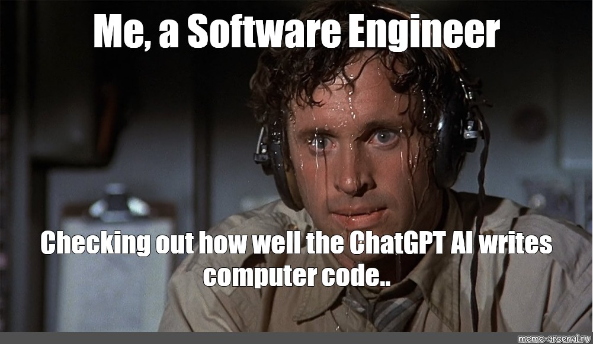

  

**Reflection on Software Engineering**

---

**I. Introduction**

ICS 314 is widely known as a course focused on web application development, but that’s only part of the picture. Beyond frameworks and deployment tools, the course introduced us to core software engineering concepts that shape how we work as developers. This reflection focuses on two of those concepts—**Issue Driven Project Management (IDPM)** and **Configuration Management**—and how they extend beyond the context of web development.

---

**II. Experience with Software Engineering Concepts**

1. **Issue Driven Project Management (IDPM)**  
   IDPM is a method of Agile Project Management that uses GitHub Issues to drive development. Each task is clearly defined with a description, assignee, due date, and status updates. This helped me clarify responsibilities within the team and made our project progress more transparent.  
   While I first thought it was just "filling out GitHub tickets," I later realized it created a natural project rhythm. I could see this being useful even for non-programming projects like planning events, managing student clubs, or coordinating internships.

2. **Configuration Management**  
   Configuration Management refers to keeping the environment, code, and settings consistent across team members. In ICS 314, we practiced this with `.env` files, environment variables, and CI/CD tools like GitHub Actions and Vercel.  
   I learned that one small mismatch in settings can cause a major issue for someone else on the team. Managing these configurations not only avoids errors but also helps in debugging and deployment. I now apply similar practices in my personal projects, like versioned `.env` files and clearly documented setup steps.

3. **Design Patterns in CI/CD**  
   While working on the final project, I realized that our approach to setting up `.env` files and deployment workflows mirrored the **Singleton Design Pattern**—one instance controlling access to configuration settings. This showed me that even design patterns I thought were “theoretical” had practical relevance in real-life projects.

---

**III. Impact on My Understanding**

These engineering principles taught me to think beyond code—how to structure work, collaborate, and plan long-term. It gave me tools to reduce chaos and create clarity when working in teams. I now appreciate project structure and code maintainability more than I did before.

---

**IV. Real-World Applications**

I’ve started using IDPM for organizing group projects and even content planning for personal websites. The same goes for Configuration Management—I now document setup instructions in my README files and make sure others can replicate my environment easily.

---

**V. Challenges and Growth**

One challenge was underestimating the importance of project management at the beginning. I thought code was everything, but this class made me realize that code without organization quickly becomes unmanageable. Facing these challenges helped me become a more thoughtful developer.

---

**VI. Traditional vs Modern Practices**

Traditional methods taught me coding fundamentals. ICS 314 bridged the gap between that and real-world engineering. Concepts like linting, version control, and testing, when combined with structured planning like IDPM, created a more professional workflow.

---

**VII. Future Outlook**

I believe these skills will carry over into any field—whether I work in data analytics, DevRel, or game development. Structured, maintainable, and scalable software practices are universal.

---

**VIII. Conclusion**

ICS 314 taught me how to code, yes—but more importantly, it taught me how to **engineer**. I now understand how planning, communication, and structure create better software and better teams. I’m leaving this course with more than just technical skills; I’m leaving with a mindset.

---

**AI Acknowledgment**  
I used ChatGPT to assist in drafting, organizing, and refining this reflection. All content is based on my personal experiences in ICS 314.
