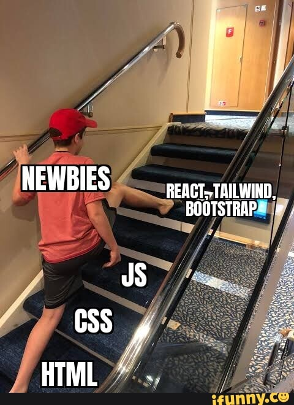

 

# **Introduction**

In the past week I started to learn Bootstrap 5 as a UI framework.  
At first I thought, "designing with this is so much easier!"  

But eventually it became more of, "Do I really have an idea about what I'm doing?"  

The more I used Bootstrap, the further my knowledge regarding HTML, CSS, and JavaScript appeared to leave my head.  

The Bootstrap is not almighty and is not really helpful in every situation. Skipping basics was making life complicated in the long run.  

---

# **The Benefits of Working with Bootstrap**

Bootstrap 5 simplified my work to a point where I was able to accomplish things quickly.  

Some most notable benefits I had were:  

- I didn't have to think about design because everything was sleek by default.  
- The responsive design was seamless – layouts resized automatically to fit different screen sizes.  
- Pre-build items like navbars and buttons have been time savers – just had to apply classes to these.  

For homework and classworks getting that perfect style in just a short while without spending an hour styling was necessary so I just used that.  

---

# **The Problem**

But with greater usage of Bootstrap, I understood that I was neglecting basics in core web development. Below are some problems I faced:  

- I was comfortable working with the grid system, but I just couldn't get Flexbox or CSS Grid.  
- I was not comfortable with CSS, so I struggled to override Bootstrap default styling.  
- I copied Bootstrap JavaScript components without properly knowing how to work with them.  

I have wondered: *"Am I just following documents in an unquestioning way without really learning?"*  

It felt like I was simply copying Bootstrap classes rather than knowing the basics.  

---

# **Bootstrap is Robust But Must Be Underpinned**

Ultimately, Bootstrap is just a tool—it doesn’t replace fundamental web development knowledge.  

While UI frameworks speed development, dependency can arise. If you're not familiar with how HTML, CSS, and JavaScript operate, you can:  

- Difficulty in making even minimal styling changes.  
- Become default because default is not an easy thing to change.  
- Feel confused when working on a project to build something in an empty context.  

---

# **Conclusion**

Using Bootstrap in university work was efficient, but was not helpful in building core competencies. instead it told me just how much I needed to learn.  

Bootstrap is perfect for instant professional designs. But this does take an in-depth understanding of HTML, CSS, and JavaScript.  

I should have done the fundamentals in advance before proceeding with a UI framework.  

In the future, I'll strive to have a better understanding of core web development concepts in order to utilize Bootstrap in an enabling role rather than relying upon it as a crutch.  

---

# **AI Acknowledgment**

I used ChatGPT to help render my essay in Markdown form and to reorganize sentences to express things in clearer language.  

All original content material, analysis, and examples were done by myself, while I used AI assistance to express things in improved readability and organization.

