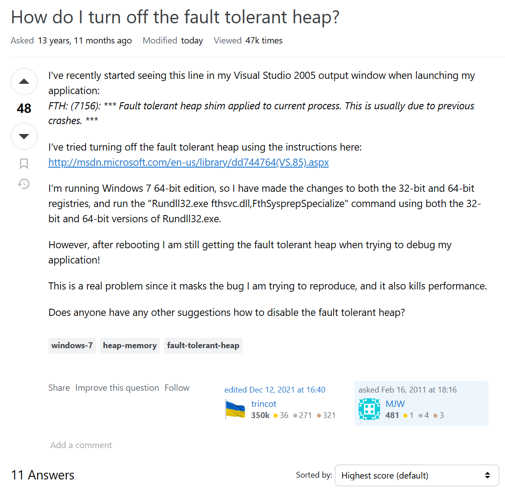
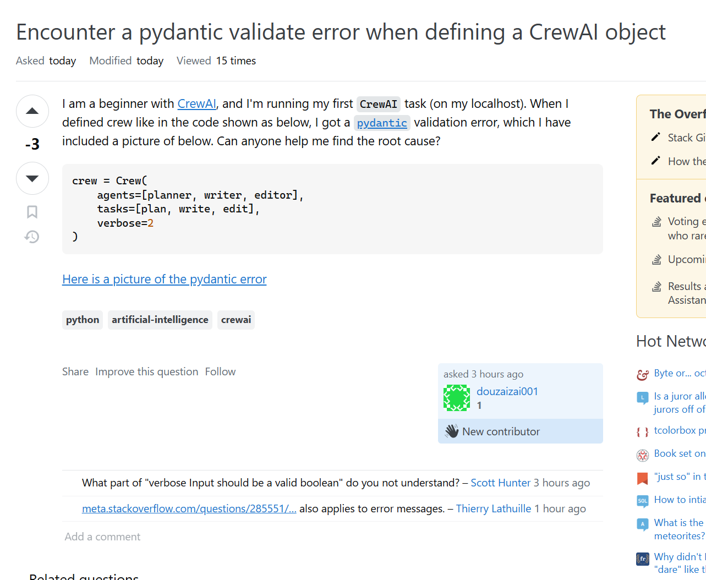

I expected to find one within a few minutes but… A further twenty minutes had passed, and I was still looking. The bottom line is, finding a smart question on Stack Overflow was way harder than I thought. The platform was full of questions, most of which were either not well-structured, catch-all, or lacked important details. It finally clicked as I scrolled through the posts: asking a question the right way isn't about getting the answer; rather, it is effective communication, problem-solving, and respect toward the community's time.

This experience taught me to appreciate Eric Raymond's essay, *"How to Ask Questions the Smart Way,"* even more. In this essay, I am going to discuss two contrasting examples from Stack Overflow—one example of a smart question and one that is not. I will be breaking the structures, responses, and outcome of these questions down and highlighting the major areas of difference between a well-structured inquiry and one that is frustrating.

---

 

[website](https://stackoverflow.com/questions/5020418/how-do-i-turn-off-the-fault-tolerant-heap)

## The Anatomy of a Smart Question

After a great deal of searching, I finally found a question that actually fit Raymond's criteria—one entitled **"How do I turn off the fault tolerant heap?"** that was well-formatted, clearly worded, and provided the necessary details to make troubleshooting possible.

The post included:

- A clear, specific title  
- A full error message in code block format  
- A description of what the user had already tried  
- Version numbers of the involved software, viz. Windows 7, Visual Studio 2005  
- A direct question seeking assistance in debugging the problem  

This helped the experts to understand the problem right away and provide an effective solution. Within a few hours, responses were received for the question, and one of the answers explained the problem and promised a solution involving registry changes and system commands to disable the fault-tolerant heap.

This is the power that a well-posed question has since the community promptly engaged, offered a diagnosis on the problem right there, and provided actionable solutions at hand.

---

link to the page ↓
[website](https://stackoverflow.com/questions/79391830/encounter-a-pydantic-validate-error-when-defining-a-crewai-object)

## The Consequences of a Poorly Asked Question

On the other hand, I came across a question that best classifies as wrong help-seeking. The question, titled **"Encounter a pydantic validate error when defining a CrewAI object,"** got downvoted with minimal engagements.

The major problems associated with this question were:

- **A vague and unhelpful title:** All the title is saying is that there was some kind of Pydantic validation error, which doesn't provide any useful information about what happened or why.  
- **No full error message:** Instead of pasting the error text itself, the user only referred to an image; this makes it harder for other people to analyze further or search for any similar issues.  
- **Lack of context in what the user had already tried:** The question doesn't say what they did try as far as debugging the problem on their own goes.  
- **No version information for Pydantic, CrewAI, or Python:** This is important because otherwise, the responders cannot identify whether the issue is version-specific.  

Because of these omissions, the would-be respondents did not have any starting point. The answers given were mostly clarifications or requests for more details rather than direct solutions to the problems. This ultimately resulted in ineffectiveness whereby a user, instead of getting an immediate answer, had to go back to give more details, which delayed their problem from being solved.

### How might this question have been better?

A better approach would have been to include:

- Full error message, in text format  
- A minimal reproducible code example  
- A list of troubleshooting steps already attempted  
- Relevant version numbers of Python, CrewAI, Pydantic  

A better title may be something like:  
**"Unable to initialize task in CrewAI due to a Pydantic Validation Error on 'tasks' argument"**  

By framing the question in this way, the user would have enhanced the prospect of getting a quick and effective response.

---

## Lessons Learned

This exercise really crystallized one important truism: **a well-asked question is the primer for good problem-solving.** The clearer, more detailed, and better-structured a question is, the more it opens itself to useful discussions and shared knowledge. Poorly asked questions cause friction and delay responses, maybe even inhibit experts from participating.

From now on, I will make sure my questions are well-structured, containing a good title, complete error messages, and a summary of what I have tried so far. This will not only help me to get better answers faster but also contribute to an efficient and supportive community on Stack Overflow.

Next time I ask for help, I'll remember those twenty minutes—and make sure I don't waste someone else's.

## AI Acknowledgment

I used ChatGPT to assist with formatting my essay into Markdown and refining sentence structure for clarity. The core content, analysis, and examples were developed by me, and AI was used as a support tool to ensure better readability and organization.

