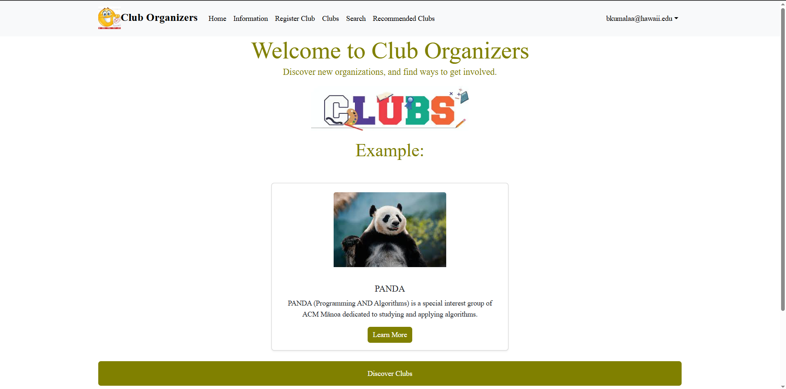
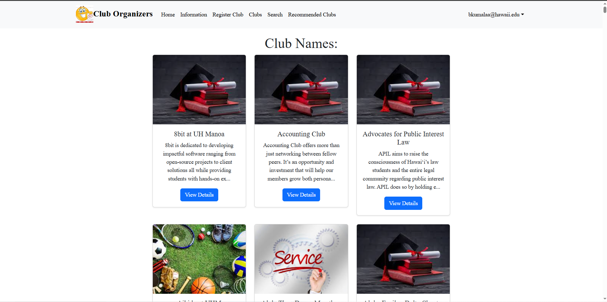
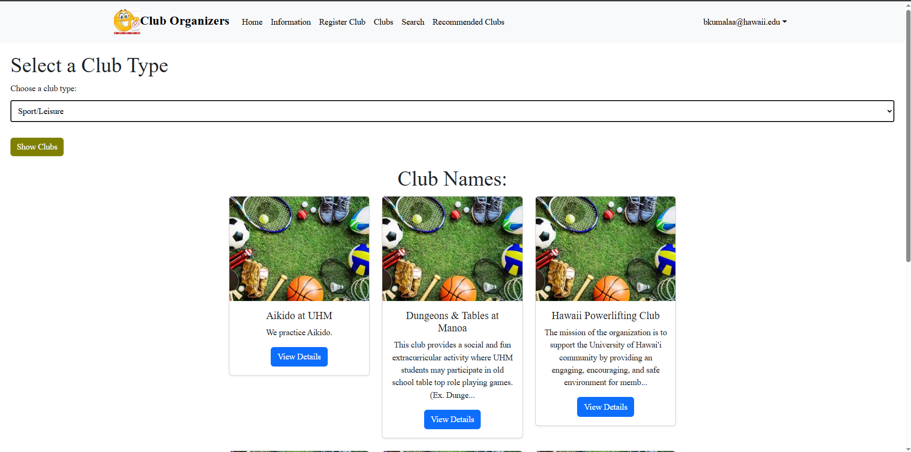

[GitHub Organization](https://github.com/club-organizers)  
[Live Demo](https://club-main-sandy.vercel.app)

        

# **Club Organizers**

## **Overview**  
Club Organizers is a web app built to help University of Hawaiʻi at Mānoa students find and manage Registered Independent Organizations (RIOs). With over 150 clubs on campus, it provides a streamlined way to explore, join, or administer student groups—all under one platform.

---

## **My Contributions**  
I focused on backend configuration and deployment, including:
- Supabase database setup and schema design
- Vercel deployment and `.env` variable management
- GitHub Actions for CI/CD with Playwright and ESLint integration

I also participated in bug fixing, documentation, and final milestone QA testing.

---

## **What I Learned**  
This project deepened my understanding of:
- Agile teamwork using GitHub Issues and Project Boards
- CI/CD practices for frontend apps
- Secure handling of environment variables across dev and production
- Collaborative workflows involving multiple admin roles and user permissions

---

## **Screenshots**

---

## **Organization Links**  
- [GitHub Organization](https://github.com/club-organizers)  
- [Project Boards (M1-M3)](https://github.com/orgs/club-organizers/projects)
- [Mockup Site](https://sites.google.com/hawaii.edu/cluborganizers/landing-page)

---
